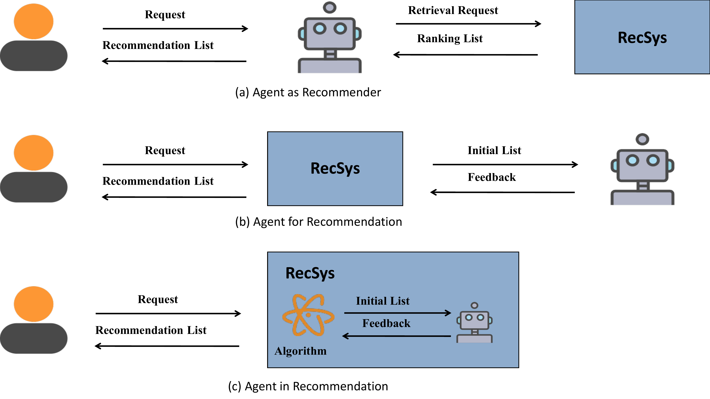
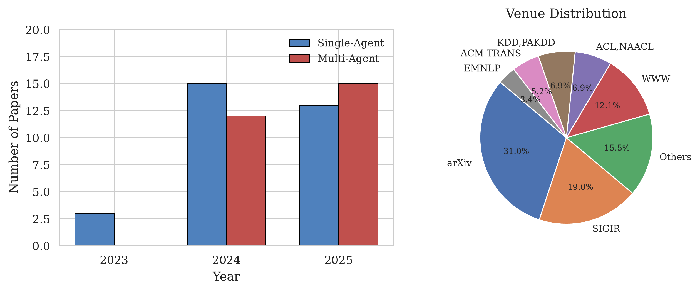

# ✨ Agent4Rec_Survey

<div align="center">
A collection of resources and papers of **LLM-Powered Agents for Recommender Systems** (Agent4Rec).

[](https://github.com/dongjingWANG/Agent4Rec_Survey)
[](https://github.com/dongjingWANG/Agent4Rec_Survey/fork)

[](https://github.com/dongjingWANG/Agent4Rec_Survey/graphs/contributors)

**🎙️ Interactive Exploration:**

[](https://github.com/dongjingWANG/Agent4Rec_Survey/issues)


</div>

------

## 📖 Abstract

In our survey,  we offers a comprehensive review of recent research on LLM-powered agents in recommendation systems from the past three years, examining four key dimensions: where agents are applied, what agents are used, why agents are used, and how agents are designed.For the **"WHERE"** question, we explore integration strategies for LLM-powered agents and recommendation systems, categorized as Agent as Rec (primary entity), Agent for Rec (interacting to enhance performance), and Agent in Rec (embedded in specific process stages). For the **"WHAT"** question, we categorize the systems according to the quantity of agents they include, distinguishing between single-agent and multi-agent setups. For the **"WHY"** question, we categorize systems according to the specific issues they tackle within improving general recommendations, domain-specific recommendations, interactive recommendations, and system evaluation. For the **"HOW"** question, we highlights optimization approaches targeting the agents' core components—Profile, Memory, Planning, and Action Modules—to boost overall system performance.

<div align="center">


</div>

------

<!-- START TABLES -->

### The comparison between this work and existing surveys.
| **Paper** | **Where** | **What** |**Why** | **How** |**Pipeline** |**Highlights** |
| :------------- | :----------------------------------------------------------- | :----------------- | :------- |:------- |:------- |:------- |
| Recommender Systems Meet Large Language Model Agents: A Survey | ❌ |✅| ❌ |✅| (1) Agents for RS (2) RS for Agents (3) Trustworthy Agents and RS | analyzes how the LLM agent module supports recommendation systems and how recommendation systems,in turn, optimize the operation of these agents. |
| A Survey on LLM-powered Agents for Recommender Systems | ❌ |✅| ❌ |✅| (1) Recommender-oriented approaches (2) Interaction-oriented approaches (3) Simulation-oriented approaches | identifies three key paradigms in current research and explores their architectural components and evaluation frameworks.|
| A Survey of Large Language Model Empowered Agents for Recommendation and Search: Towards Next-Generation Information Retrieval | ❌ |✅| ❌ |✅| (1) User Interaction (2) Item Representation (3) System Integration (4) Environment Simulation | emphasizes how LLM-powered agents improve recommender systems by enabling deep semantic understanding, dynamic task decomposition, and interactive user engagement |
| **Ours** |✅|✅|✅|✅| (1) Where agents are applied (2) What agents are used (3) Why agents are used (4) How agents are designed | proposes four key questions—"Where," "What," "Why," and "How" to conduct a comprehensive analysis of the existing academic research. |
<!-- END TABLES -->

------

## Key Contributions

1. A comprehensive review of the application of agents in RS across four dimensions from 2023 to 2025.
2. A novel system taxonomy is proposed, categorizing the integration strategies of LLM-powered agents in recommendation systems into three paradigms.
3. Challenges for recommendation agents include computational cost, confidence, data security, robustness, and scalability among multiple agents.

------

<!-- START EXPLORE -->

**🔍 Explore This Survey:**

- 📊 **[Where](#-data)**: The integration strategies for LLM-powered agents and recommendation systems
  - [📊 Agent as Rec](#agent-as-rec)
  - [🎯 Agent for Rec](#agent-for-rec)
  - [📥 Agent in Rec](#agent-in-rec)
- 🛠️ **[What](#%EF%B8%8F-methods)**: The systems according to the quantity of agents they include
  - [🤖 Single-Agent Systems](#single-agent-systems)
  - [👥 Multi-Agent Systems](#multi-agent-systems)
- 🔍 **[Why](#-analysis)**: The specific issues they tackle within
  - [📈 General Recommendations](#general-recommendations)
  - [🔍 Domain-Specific Recommendations](#domain-specific-recommendations)
  - [📚 Interactive Recommendations](#interactive-recommendations)
  - [🎮 System Evaluation](#system-evaluation)
- 📋 **[How](https://deepsoftwareanalytics.github.io/Awesome-Issue-Resolution/tables/)**: The agents' core components
- 📄 **[Full Paper](https://deepsoftwareanalytics.github.io/Awesome-Issue-Resolution/paper/)**: Read the complete survey paper
  <!-- END EXPLORE -->

------

<!-- START TABLES -->

## Paper List

### 📊WHERE

We analyze three integration strategies for LLM agents and recommender systems: Agent as Rec, Agent for Rec, and Agent in Rec.

<div align="center">



</div>

#### 📊Agent as Rec

| **Model Name** | **Paper**     | **Single/Multi** | **Application Scenarios** |**Venue** |
| :------------- | :----------- | :--------|:--------| :-------- |
| PUMA | [Large Language Models Empowered Personalized Web Agents](https://dl.acm.org/doi/10.1145/3696410.3714842) | Single | Domain-Specific | WWW'25  |
| STARec |[STARec: An Efficient Agent Framework for Recommender Systems via Autonomous Deliberate Reasoning](https://dl.acm.org/doi/10.1145/3746252.3760995) | Single | General Recommendation | CIKM'25 |
| REMI |[REMI: A Novel Causal Schema Memory Architecture for Personalized Lifestyle Recommendation Agents](https://oars-workshop.github.io/papers/Raman2025.pdf) | Single | Domain-Specific | KDD'25 |
| AgentDR |[AgentDR: Dynamic Recommendation with Implicit Item-Item Relations via LLM-based Agents](https://arxiv.org/pdf/2510.05598) | Single | General Recommendation | arXiv'25 |
| TAIRA | [Thought-Augmented Planning for LLM-Powered Interactive Recommender Agent](https://arxiv.org/abs/2506.23485) | Multi | Interactive Improvement | arXiv'25|
| MARC | [MARC: Multimodal and Multi-Task Agentic Retrieval-Augmented Generation for Cold-Start Recommender System](https://arxiv.org/abs/2511.08181) | Multi | Domain-Specific | CIKM'25|
| MMAgentRec | [MMAgentRec, a personalized multi-modal recommendation agent with large language model](https://www.nature.com/articles/s41598-025-96458-w) | Multi | Domain-Specific | Scientific Reports'25|
| MATCHA | [MATCHA:CanMulti-Agent Collaboration Build a Trustworthy  Conversational Recommender?](https://arxiv.org/pdf/2504.20094) | Multi | Interactive Improvement | arXiv'25 |
| RouteLLM| [Constraint-Aware Route Recommendation from Natural Language via Hierarchical LLM Agents](https://arxiv.org/pdf/2510.06078) | Multi | Domain-Specific | arXiv'25|
| CDA4Rec | [Cloud-Device Collaborative Agents for Sequential Recommendation](https://arxiv.org/pdf/2509.01551) | Multi | Domain-Specific | arXiv'25|
| ChatCRS | [Incorporating External Knowledge and Goal Guidance for LLM-based Conversational Recommender Systems](https://aclanthology.org/2025.findings-naacl.17/) | Multi | Interactive Improvement | NAACL'25 |
| MADREC | [MADREC:AMulti-Aspect Driven LLM Agent for Explainable and Adaptive Recommendation](https://arxiv.org/pdf/2510.13371) | Single | General Recommendation | arXiv'25 |
| InteRecAgent| [Recommender AI Agent: Integrating Large Language Models for Interactive Recommendations](https://dl.acm.org/doi/full/10.1145/3731446) |Single | Interactive Improvement | ACM TRANS'25 |
| MAS4POI | [MAS4POI: a Multi-Agents Collaboration System  for Next POI Recommendation](https://link.springer.com/chapter/10.1007/978-981-96-8180-8_28) | Multi | Domain-Specific |PAKDD'24 |
| RecMind | [RecMind: Large Language Model Powered Agent For Recommendation](https://aclanthology.org/2024.findings-naacl.271/) |Single | General Recommendation | NAACL'24   |
| Shuang et al. | [An Extremely Data-efficient and Generative LLM-based Reinforcement Learning Agent for Recommenders](https://arxiv.org/pdf/2408.16032) | Single | Domain-Specific | KDD'24  |
| RecAI | [RecAI: Leveraging Large Language Models for Next-Generation Recommender Systems](https://dl.acm.org/doi/abs/10.1145/3589335.3651242) |Single | General Recommendation | WWW'24 |
| MACRec | [MACRec: a Multi-Agent Collaboration Framework for Recommendation](https://dl.acm.org/doi/abs/10.1145/3626772.3657669) | Multi | General Recommendation |SIGIR'24 |
| MACRS | [A Multi-Agent Conversational Recommender System](https://arxiv.org/pdf/2402.01135) | Multi | Interactive Improvement | arXiv'24  |
| PMS | [Personalized Recommendation Systems using Multimodal, Autonomous, Multi Agent Systems](https://arxiv.org/pdf/2410.19855) | Multi | Interactive Improvement | arXiv'24  |
| Rec4Agentverse | [Prospect Personalized Recommendation on Large Language Model-based Agent Platform](https://arxiv.org/pdf/2402.18240) | Multi | Interactive Improvement | arXiv'24  |
| AutoConcierge | [Automated Interactive Domain-Specific Conversational Agents that Understand Human Dialogs](https://link.springer.com/chapter/10.1007/978-3-031-52038-9_13) |Single | Domain-Specific | PADL'24 |

#### 🎯Agent for Rec

| **Model Name**  | **Paper** | **Single/Multi** | **Application Scenarios** | **Venue** |
| :--------------- | :-------|:--------|:--------| :--------|
| DrunkAgent | [Get the Agents Drunk: Memory Perturbations in Autonomous  Agent-based Recommender Systems](https://arxiv.org/pdf/2503.23804) |Single | Evaluation & Security | arXiv'25 |
| iAgent | [iAgent: LLM Agent as a Shield between User and Recommender Systems](https://arxiv.org/pdf/2502.14662) | Single | Interactive Improvement | ACL'25|
| iALP | [Large Language Model driven Policy Exploration for  Recommender Systems](https://dl.acm.org/doi/abs/10.1145/3701551.3703496) |Single | Interactive Improvement | WSDM'25 |
| RuleAgent | [RuleAgent: Discovering Rules for Recommendation Denoising  with Autonomous Language Agents](https://arxiv.org/pdf/2503.23374) |Single | Domain-Specific | arXiv'25  |
| CARTS | [CARTS: Collaborative agents for recommendation textual summarization](http://arxiv.org/pdf/2506.17765) | Multi | Domain-Specific |arXiv'25 |
| RecUserSim | [RecUserSim: A Realistic and Diverse User Simulator for  Evaluating Conversational Recommender Systems](https://dl.acm.org/doi/pdf/10.1145/3701716.3715258) |Single | Evaluation & Security | WWW'25 |
| DiscomfortFilter | [Filtering discomforting recommendations with large language models](https://dl.acm.org/doi/abs/10.1145/3696410.3714850) |Multi | Domain-Specific | WWW'25 |
| RecAgent | [User Behavior Simulation with Large Language Model based Agents](https://dl.acm.org/doi/full/10.1145/3708985) | Single | Evaluation & Security | ACM TRANS'25 |
| Chirag Shah et al. | [Dynamic Evaluation Framework for Personalized and Trustworthy Agents: A Multi-Session Approach to Preference Adaptability](https://www.arxiv.org/pdf/2504.06277) | Multi | Evaluation & Security | arXiv'25 |
| TextSimu | [ID-Free Not Risk-Free: LLM-Powered Agents Unveil Risks in  ID-Free Recommender Systems](https://dl.acm.org/doi/abs/10.1145/3726302.3730003) | Multi | Evaluation & Security | SIGIR'25  |
| CreAgent | [CreAgent: Towards Long-Term Evaluation of Recommender System under Platform-Creator Information Asymmetry](https://arxiv.org/pdf/2502.07307) |Single | Evaluation & Security | arXiv'25  |
| Lusifer | [Lusifer: LLM-based User Simulated Feedback  Environment For online Recommender systems](https://ieeexplore.ieee.org/abstract/document/11141085/) |Single | Domain-Specific | IEEE'25 |
| CSHI | [A LLM-based Controllable, Scalable, Human-Involved User Simulator Framework for Conversational Recommender Systems](https://dl.acm.org/doi/abs/10.1145/3696410.3714858) |Single | Interactive Improvement | WWW'25 |
| Zhang et al. | [LLM-Powered User Simulator for Recommender System](https://ojs.aaai.org/index.php/AAAI/article/view/33456) |Single |  General Recommendation |AAAI'25 |
| SUBER | [SUBER: An RL Environment with Simulated  Human Behavior for Recommender Systems](https://arxiv.org/pdf/2406.01631) |Single | Evaluation & Security | arXiv'24 |
| SimpleUserSim | [How Reliable is Your Simulator? Analysis on the Limitations of  Current LLM-based User Simulators for Conversational  Recommendation](https://dl.acm.org/doi/abs/10.1145/3589335.3651955) |Single | Evaluation & Security | WWW'24 |
| RAH  | [RAH! RecSys-Assistant-Human: A Human-Centered Recommendation Framework with LLM Agents](https://ieeexplore.ieee.org/abstract/document/10572486) |Multi | General Recommendation |TCSS'24 |
| Agent4Rec | [On Generative Agents in Recommendation](https://dl.acm.org/doi/abs/10.1145/3626772.3657844) |Multi| Evaluation & Security | SIGIR'24  |
| PEPPER | [Stop Playing the Guessing Game ! Target-free User Simulation for Evaluating Conversational Recommender Systems](https://www.arxiv.org/pdf/2411.16160) |Single| Evaluation & Security | arXiv'24  |
| PEARL | [PEARL: Preference Extraction with Exemplar Augmentation and Retrieval with LLM Agents](https://aclanthology.org/2024.emnlp-industry.112.pdf) | Multi | Domain-Specific | EMNLP'24 |
| Yoon et al.| [Evaluating Large Language Models as Generative User Simulators for  Conversational Recommendation](https://aclanthology.org/2024.naacl-long.83/) |Single |Evaluation & Security | ACL'24  |
| CheatAgent  | [CheatAgent: Attacking LLM-Empowered Recommender Systems via LLM Agent](https://dl.acm.org/doi/10.1145/3637528.3671837) |Single | Evaluation & Security | KDD'24 |
| ToolRec   | [Let Me Do It For You: Towards LLM Empowered Recommendation via Tool Learning](https://dl.acm.org/doi/abs/10.1145/3626772.3657828) |Single | Domain-Specific |SIGIR'24 |
| USimAgent | [USimAgent: Large Language Models for Simulating Search Users](https://dl.acm.org/doi/abs/10.1145/3626772.3657963) |Single | Evaluation & Security | SIGIR'24 |
| CORE | [Lending Interaction Wings to Recommender Systems with Conversational Agents](https://proceedings.neurips.cc/paper_files/paper/2023/hash/58cd3b02902d79aea4b3b603fb0d0941-Abstract-Conference.html) |Single | Interactive Improvement | NeurlPS'23  |
| iEvaLM | [Rethinking the Evaluation for Conversational Recommendation  in the Era of Large Language Models](https://arxiv.org/pdf/2305.13112) | Single | Evaluation & Security | EMNLP'23 |

#### 📥 Agent in Rec
| **Model Name** | **Paper**   | **Single/Multi** | **Application Scenarios** | **Venue**|
| :------------- | :---------- | :--------|:--------|:------|
| AgentCF++ | [AgentCF++: Memory-enhanced LLM-based Agents for  Popularity-aware Cross-domain Recommendations](https://dl.acm.org/doi/abs/10.1145/3726302.3730161) | Multi | General Recommendation | SIGIR'25 |
| RPP | [Reinforced prompt personalization for recommendation with large language models](https://dl.acm.org/doi/full/10.1145/3716320) | Multi | General Recommendation | ACM TRANS'25 |
| ARAG | [ARAG: Agentic Retrieval Augmented Generation for  Personalized Recommendation](https://arxiv.org/pdf/2506.21931) |Multi | General Recommendation |SIGIR'25 |
| VRAgent-R1 | [VRAgent-R1: Boosting Video Recommendation with MLLM-based Agents via Reinforcement Learning](https://arxiv.org/pdf/2507.02626) |Multi | Domain-Specific | arXiv'25 |
| AFL  | [Agentic Feedback Loop Modeling Improves Recommendation  and User Simulation](https://dl.acm.org/doi/abs/10.1145/3726302.3729893) | Multi | Domain-Specific | SIGIR'25 |
| KGLA | [KGLA: Knowledge Graph Enhanced Language Agents for Recommendation](https://arxiv.org/pdf/2410.19627) | Multi | General Recommendation |arXiv'24  |
| Jie Wang et al.| [Reinforcement Learning-based Recommender Systems with  Large Language Models for State Reward and Action Modeling](https://dl.acm.org/doi/abs/10.1145/3626772.3657767) | Single | General Recommendation |SIGIR'24|
| BiLLP | [Large Language Models are Learnable Planners for Long-Term  Recommendation](https://dl.acm.org/doi/abs/10.1145/3626772.3657683) | Multi | Evaluation & Security | SIGIR'24 |
| AgentCF | [AgentCF: Collaborative Learning with Autonomous Language  Agents for Recommender Systems](https://dl.acm.org/doi/abs/10.1145/3589334.3645537) |Multi | Interactive Improvement | WWW'24 |
| CSA | [Contrastive State Augmentations for Reinforcement  Learning-Based Recommender Systems](https://dl.acm.org/doi/abs/10.1145/3539618.3591656) | Single | General Recommendation |SIGIR'23 |

<!-- END TABLES -->

------

<!-- START PAPERS -->

### 🛠️WHAT

We examine the system architecture, cat egorizing it into single-agent systems and multi-agent systems based on the number of agents involved.

<div align="center">



</div>

#### 🤖Single-Agent Systems

**AutoConcierge**：Automated Interactive Domain-Specific Conversational Agents that Understand Human Dialogs[](https://link.springer.com/chapter/10.1007/978-3-031-52038-9_13)

**RecAI**: RecAI: Leveraging Large Language Models for Next-Generation Recommender Systems[](https://dl.acm.org/doi/abs/10.1145/3589335.3651242)

**Shuang et al.**: An Extremely Data-efficient and Generative LLM-based Reinforcement Learning Agent for Recommenders[](https://arxiv.org/pdf/2408.16032)

**InteRecAgent**: Recommender AI Agent: Integrating Large Language Models for Interactive Recommendations[](https://dl.acm.org/doi/full/10.1145/3731446)

**RecMind**: RecMind: Large Language Model Powered Agent For Recommendation[](https://aclanthology.org/2024.findings-naacl.271/)

**MADREC**: MADREC: A Multi-Aspect Driven LLM Agent for Explainable and Adaptive Recommendation[](https://arxiv.org/pdf/2510.13371)

**PUMA**: Large Language Models Empowered Personalized Web Agents[](https://dl.acm.org/doi/10.1145/3696410.3714842)

**STARec**: STARec: An Efficient Agent Framework for Recommender Systems via Autonomous Deliberate Reasoning[](https://dl.acm.org/doi/10.1145/3746252.3760995)

**REMI**: REMI: A Novel Causal Schema Memory Architecture for Personalized Lifestyle Recommendation Agents[](https://oars-workshop.github.io/papers/Raman2025.pdf)

**AgentDR**: AgentDR: Dynamic Recommendation with Implicit Item-Item Relations via LLM-based Agents[](https://arxiv.org/pdf/2510.05598)

**iEvaLM**: Rethinking the Evaluation for Conversational Recommendation  in the Era of Large Language Models[](https://arxiv.org/pdf/2305.13112)

**CORE**: Lending Interaction Wings to Recommender Systems with Conversational Agents[](https://proceedings.neurips.cc/paper_files/paper/2023/hash/58cd3b02902d79aea4b3b603fb0d0941-Abstract-Conference.html)

**USimAgent**: USimAgent: Large Language Models for Simulating Search Users[](https://dl.acm.org/doi/abs/10.1145/3626772.3657963)

**Zhang et al.**: LLM-Powered User Simulator for Recommender System[](https://ojs.aaai.org/index.php/AAAI/article/view/33456)

**CheatAgent**:   CheatAgent: Attacking LLM-Empowered Recommender Systems via LLM Agent[](https://dl.acm.org/doi/10.1145/3637528.3671837)

**PEPPER**: Stop Playing the Guessing Game ! Target-free User Simulation for Evaluating Conversational Recommender Systems[](https://www.arxiv.org/pdf/2411.16160)

**ToolRec**: Let Me Do It For You: Towards LLM Empowered Recommendation via Tool Learning[](https://dl.acm.org/doi/abs/10.1145/3626772.3657828)

**Yoon et al.**:   Evaluating Large Language Models as Generative User Simulators for  Conversational Recommendation[](https://aclanthology.org/2024.naacl-long.83/)

**SimpleUserSim**: How Reliable is Your Simulator? Analysis on the Limitations of  Current LLM-based User Simulators for Conversational  Recommendation[](https://dl.acm.org/doi/abs/10.1145/3589335.3651955)

**SUBER**: SUBER: An RL Environment with Simulated  Human Behavior for Recommender Systems[](https://arxiv.org/pdf/2406.01631)

**CSHI**: A LLM-based Controllable, Scalable, Human-Involved User Simulator Framework for Conversational Recommender Systems[](https://dl.acm.org/doi/abs/10.1145/3696410.3714858)

**Lusifer**: Lusifer: LLM-based User Simulated Feedback  Environment For online Recommender systems[](https://ieeexplore.ieee.org/abstract/document/11141085/)

**iALP**: Large Language Model driven Policy Exploration for  Recommender Systems[](https://dl.acm.org/doi/abs/10.1145/3701551.3703496)

**iAgent**: iAgent: LLM Agent as a Shield between User and Recommender Systems[](https://arxiv.org/pdf/2502.14662)

**RecAgent**: User Behavior Simulation with Large Language Model based Agents[](https://dl.acm.org/doi/full/10.1145/3708985)

**RecUserSim**: RecUserSim: A Realistic and Diverse User Simulator for  Evaluating Conversational Recommender Systems[](https://dl.acm.org/doi/pdf/10.1145/3701716.3715258)

**CreAgent**: CreAgent: Towards Long-Term Evaluation of Recommender System under Platform-Creator Information Asymmetry[](https://arxiv.org/pdf/2502.07307)

**DrunkAgent**: Get the Agents Drunk: Memory Perturbations in Autonomous  Agent-based Recommender Systems[](https://arxiv.org/pdf/2503.23804)

**RuleAgent**: RuleAgent: Discovering Rules for Recommendation Denoising  with Autonomous Language Agents[](https://arxiv.org/pdf/2503.23374)

**CSA**: Contrastive State Augmentations for Reinforcement  Learning-Based Recommender Systems[](https://dl.acm.org/doi/abs/10.1145/3539618.3591656)

**Jie Wang et al.**:   Reinforcement Learning-based Recommender Systems with  Large Language Models for State Reward and Action Modeling[](https://dl.acm.org/doi/abs/10.1145/3626772.3657767)

#### 👥Multi-Agent Systems

**Rec4Agentverse**: Prospect Personalized Recommendation on Large Language Model-based Agent Platform [](https://arxiv.org/pdf/2402.18240)

**PMS**: Personalized Recommendation Systems using Multimodal, Autonomous, Multi Agent Systems [](https://arxiv.org/pdf/2410.19855)

**MACRS**: A Multi-Agent Conversational Recommender System[](https://arxiv.org/pdf/2402.01135)

**MACRec**: MACRec: a Multi-Agent Collaboration Framework for Recommendation[](https://dl.acm.org/doi/abs/10.1145/3626772.3657669)

**MAS4POI**: MAS4POI: a Multi-Agents Collaboration System  for Next POI Recommendation[](https://link.springer.com/chapter/10.1007/978-981-96-8180-8_28)

**TAIRA**:  Thought-Augmented Planning for LLM-Powered Interactive Recommender Agent [](https://arxiv.org/abs/2506.23485)

**ChatCRS**: Incorporating External Knowledge and Goal Guidance for LLM-based Conversational Recommender Systems[](https://aclanthology.org/2025.findings-naacl.17/)

**MMAgentRec**: MMAgentRec, a personalized multi-modal recommendation agent with large language model[](https://www.nature.com/articles/s41598-025-96458-w)

**CDA4Rec**: Cloud-Device Collaborative Agents for Sequential Recommendation[](https://arxiv.org/pdf/2509.01551)

**RouteLLM**: Constraint-Aware Route Recommendation from Natural Language via Hierarchical LLM Agents[](https://arxiv.org/pdf/2510.06078)

**MARC**: MARC: Multimodal and Multi-Task Agentic Retrieval-Augmented Generation for Cold-Start Recommender System[](https://arxiv.org/abs/2511.08181)

**MATCHA**: MATCHA: Can Multi-Agent Collaboration Build a Trustworthy  Conversational Recommender?[](https://arxiv.org/pdf/2504.20094)

**Agent4Rec**: On Generative Agents in Recommendation[](https://dl.acm.org/doi/abs/10.1145/3626772.3657844)

**RAH**:   RAH! RecSys-Assistant-Human: A Human-Centered Recommendation Framework with LLM Agents[](https://ieeexplore.ieee.org/abstract/document/10572486)

**PEARL**: PEARL: Preference Extraction with Exemplar Augmentation and Retrieval with LLM Agents[](https://aclanthology.org/2024.emnlp-industry.112.pdf)

**TextSimu**：ID-Free Not Risk-Free: LLM-Powered Agents Unveil Risks in  ID-Free Recommender Systems[](https://dl.acm.org/doi/abs/10.1145/3726302.3730003)

**CARTS**: CARTS: Collaborative agents for recommendation textual summarization[](http://arxiv.org/pdf/2506.17765)

**DiscomfortFilter**: Filtering discomforting recommendations with large language models[](https://dl.acm.org/doi/abs/10.1145/3696410.3714850)

**Chirag Shah et al.**: Dynamic Evaluation Framework for Personalized and Trustworthy Agents: A Multi-Session Approach to Preference Adaptability[](https://www.arxiv.org/pdf/2504.06277)

**AgentCF**:   AgentCF: Collaborative Learning with Autonomous Language  Agents for Recommender Systems[](https://dl.acm.org/doi/abs/10.1145/3589334.3645537)

**BiLLP**: Large Language Models are Learnable Planners for Long-Term  Recommendation[](https://dl.acm.org/doi/abs/10.1145/3626772.3657683)

**AFL**: Agentic Feedback Loop Modeling Improves Recommendation  and User Simulation[](https://dl.acm.org/doi/abs/10.1145/3726302.3729893)

**KGLA**: KGLA: Knowledge Graph Enhanced Language Agents for Recommendation[](https://arxiv.org/pdf/2410.19627)

**VRAgent-R1**: VRAgent-R1: Boosting Video Recommendation with MLLM-based Agents via Reinforcement Learning[](https://arxiv.org/pdf/2507.02626)

**ARAG**: ARAG: Agentic Retrieval Augmented Generation for  Personalized Recommendation[](https://arxiv.org/pdf/2506.21931)

**AgentCF++**:   AgentCF++: Memory-enhanced LLM-based Agents for  Popularity-aware Cross-domain Recommendations[](https://dl.acm.org/doi/abs/10.1145/3726302.3730161)

**RPP**: Reinforced prompt personalization for recommendation with large language models[](https://dl.acm.org/doi/full/10.1145/3716320)

### 🔍  WHY

We investigate the underlying rationale for the design of each agent. This analysis reveals four distinct classification criteria: the enhancement of general recommendation tasks, the consideration of vertical and domain-specific scenarios, the facilitation and improvement of interactive recommendations, and the assessment of the performance of recommender systems.

<div align="center">


</div>

#### 📈 General Recommendations

**RecMind**: RecMind: Large Language Model Powered Agent For Recommendation[](https://aclanthology.org/2024.findings-naacl.271/)

**MACRec**: MACRec: a Multi-Agent Collaboration Framework for Recommendation[](https://dl.acm.org/doi/abs/10.1145/3626772.3657669)

**RecAI**: RecAI: Leveraging Large Language Models for Next-Generation Recommender Systems[](https://dl.acm.org/doi/abs/10.1145/3589335.3651242)

**AgentCF++**:   AgentCF++: Memory-enhanced LLM-based Agents for  Popularity-aware Cross-domain Recommendations[](https://dl.acm.org/doi/abs/10.1145/3726302.3730161)

**RAH**:   RAH! RecSys-Assistant-Human: A Human-Centered Recommendation Framework with LLM Agents[](https://ieeexplore.ieee.org/abstract/document/10572486)

**Zhang et al.**: LLM-Powered User Simulator for Recommender System[](https://ojs.aaai.org/index.php/AAAI/article/view/33456)

**Jie Wang et al.**:   Reinforcement Learning-based Recommender Systems with  Large Language Models for State Reward and Action Modeling[](https://dl.acm.org/doi/abs/10.1145/3626772.3657767)

**CSA**: Contrastive State Augmentations for Reinforcement  Learning-Based Recommender Systems[](https://dl.acm.org/doi/abs/10.1145/3539618.3591656)

**KGLA**: KGLA: Knowledge Graph Enhanced Language Agents for Recommendation[](https://arxiv.org/pdf/2410.19627)

**STARec**: STARec: An Efficient Agent Framework for Recommender Systems via Autonomous Deliberate Reasoning[](https://dl.acm.org/doi/10.1145/3746252.3760995)

**MADREC**: MADREC:AMulti-Aspect Driven LLM Agent for Explainable and Adaptive Recommendation[](https://arxiv.org/pdf/2510.13371)

**AgentDR**: AgentDR: Dynamic Recommendation with Implicit Item-Item Relations via LLM-based Agents[](https://arxiv.org/pdf/2510.05598)

**RPP**: Reinforced prompt personalization for recommendation with large language models[](https://dl.acm.org/doi/full/10.1145/3716320)

**ARAG**: ARAG: Agentic Retrieval Augmented Generation for  Personalized Recommendation[](https://arxiv.org/pdf/2506.21931)

#### 🔍Domain-Specific Recommendations

**ToolRec**: Let Me Do It For You: Towards LLM Empowered Recommendation via Tool Learning[](https://dl.acm.org/doi/abs/10.1145/3626772.3657828)

**Shuang et al.**: An Extremely Data-efficient and Generative LLM-based Reinforcement Learning Agent for Recommenders[](https://arxiv.org/pdf/2408.16032)

**AutoConcierge**：Automated Interactive Domain-Specific Conversational Agents that Understand Human Dialogs[](https://link.springer.com/chapter/10.1007/978-3-031-52038-9_13)

**MMAgentRec**: MMAgentRec, a personalized multi-modal recommendation agent with large language model[](https://www.nature.com/articles/s41598-025-96458-w)

**MAS4POI**: MAS4POI: a Multi-Agents Collaboration System  for Next POI Recommendation[](https://link.springer.com/chapter/10.1007/978-981-96-8180-8_28)

**DiscomfortFilter**: Filtering discomforting recommendations with large language models[](https://dl.acm.org/doi/abs/10.1145/3696410.3714850)

**Lusifer**: Lusifer: LLM-based User Simulated Feedback  Environment For online Recommender systems[](https://ieeexplore.ieee.org/abstract/document/11141085/)

**RuleAgent**: RuleAgent: Discovering Rules for Recommendation Denoising  with Autonomous Language Agents[](https://arxiv.org/pdf/2503.23374)

**PEARL**: PEARL: Preference Extraction with Exemplar Augmentation and Retrieval with LLM Agents[](https://aclanthology.org/2024.emnlp-industry.112.pdf)

**CARTS**: CARTS: Collaborative agents for recommendation textual summarization[](http://arxiv.org/pdf/2506.17765)

**VRAgent-R1**: VRAgent-R1: Boosting Video Recommendation with MLLM-based Agents via Reinforcement Learning[](https://arxiv.org/pdf/2507.02626)

**PUMA**: Large Language Models Empowered Personalized Web Agents[](https://dl.acm.org/doi/10.1145/3696410.3714842)

**CDA4Rec**: Cloud-Device Collaborative Agents for Sequential Recommendation[](https://arxiv.org/pdf/2509.01551)

**REMI**: REMI: A Novel Causal Schema Memory Architecture for Personalized Lifestyle Recommendation Agents[](https://oars-workshop.github.io/papers/Raman2025.pdf)

**RouteLLM**: Constraint-Aware Route Recommendation from Natural Language via Hierarchical LLM Agents[](https://arxiv.org/pdf/2510.06078)

**MARC**: MARC: Multimodal and Multi-Task Agentic Retrieval-Augmented Generation for Cold-Start Recommender System[](https://arxiv.org/abs/2511.08181)

**AFL**: Agentic Feedback Loop Modeling Improves Recommendation  and User Simulation[](https://dl.acm.org/doi/abs/10.1145/3726302.3729893)

#### 📚Interactive Recommendations

**iAgent**: iAgent: LLM Agent as a Shield between User and Recommender Systems[](https://arxiv.org/pdf/2502.14662)

**InteRecAgent**: Recommender AI Agent: Integrating Large Language Models for Interactive Recommendations[](https://dl.acm.org/doi/full/10.1145/3731446)

**MACRS**: A Multi-Agent Conversational Recommender System[](https://arxiv.org/pdf/2402.01135)

**Rec4Agentverse**: Prospect Personalized Recommendation on Large Language Model-based Agent Platform [](https://arxiv.org/pdf/2402.18240)

**TAIRA**:  Thought-Augmented Planning for LLM-Powered Interactive Recommender Agent [](https://arxiv.org/abs/2506.23485)

**MATCHA**: MATCHA:CanMulti-Agent Collaboration Build a Trustworthy  Conversational Recommender?[](https://arxiv.org/pdf/2504.20094)

**CSHI**: A LLM-based Controllable, Scalable, Human-Involved User Simulator Framework for Conversational Recommender Systems[](https://dl.acm.org/doi/abs/10.1145/3696410.3714858)

**iALP**: Large Language Model driven Policy Exploration for  Recommender Systems[](https://dl.acm.org/doi/abs/10.1145/3701551.3703496)

**CORE**: Lending Interaction Wings to Recommender Systems with Conversational Agents[](https://proceedings.neurips.cc/paper_files/paper/2023/hash/58cd3b02902d79aea4b3b603fb0d0941-Abstract-Conference.html)

**ChatCRS**: Incorporating External Knowledge and Goal Guidance for LLM-based Conversational Recommender Systems[](https://aclanthology.org/2025.findings-naacl.17/)

**AgentCF**:   AgentCF: Collaborative Learning with Autonomous Language  Agents for Recommender Systems[](https://dl.acm.org/doi/abs/10.1145/3589334.3645537)

**PMS**: Personalized Recommendation Systems using Multimodal, Autonomous, Multi Agent Systems [](https://arxiv.org/pdf/2410.19855)

#### 🎮System Evaluation

**iEvaLM**: Rethinking the Evaluation for Conversational Recommendation  in the Era of Large Language Models[](https://arxiv.org/pdf/2305.13112)

**BiLLP**: Large Language Models are Learnable Planners for Long-Term  Recommendation[](https://dl.acm.org/doi/abs/10.1145/3626772.3657683)

**RecAgent**: User Behavior Simulation with Large Language Model based Agents[](https://dl.acm.org/doi/full/10.1145/3708985)

**DrunkAgent**: Get the Agents Drunk: Memory Perturbations in Autonomous  Agent-based Recommender Systems[](https://arxiv.org/pdf/2503.23804)

**SimpleUserSim**: How Reliable is Your Simulator? Analysis on the Limitations of  Current LLM-based User Simulators for Conversational  Recommendation[](https://dl.acm.org/doi/abs/10.1145/3589335.3651955)

**CreAgent**: CreAgent: Towards Long-Term Evaluation of Recommender System under Platform-Creator Information Asymmetry[](https://arxiv.org/pdf/2502.07307)

**Yoon et al.**:   Evaluating Large Language Models as Generative User Simulators for  Conversational Recommendation[](https://aclanthology.org/2024.naacl-long.83/)

**USimAgent**: USimAgent: Large Language Models for Simulating Search Users[](https://dl.acm.org/doi/abs/10.1145/3626772.3657963)

**Chirag Shah et al.**: Dynamic Evaluation Framework for Personalized and Trustworthy Agents: A Multi-Session Approach to Preference Adaptability[](https://www.arxiv.org/pdf/2504.06277)

**TextSimu**：ID-Free Not Risk-Free: LLM-Powered Agents Unveil Risks in  ID-Free Recommender Systems[](https://dl.acm.org/doi/abs/10.1145/3726302.3730003)

**RecUserSim**: RecUserSim: A Realistic and Diverse User Simulator for  Evaluating Conversational Recommender Systems[](https://dl.acm.org/doi/pdf/10.1145/3701716.3715258)

**PEPPER**: Stop Playing the Guessing Game ! Target-free User Simulation for Evaluating Conversational Recommender Systems[](https://www.arxiv.org/pdf/2411.16160)

**Agent4Rec**: On Generative Agents in Recommendation[](https://dl.acm.org/doi/abs/10.1145/3626772.3657844)

**SUBER**: SUBER: An RL Environment with Simulated  Human Behavior for Recommender Systems[](https://arxiv.org/pdf/2406.01631)

**CheatAgent**:   CheatAgent: Attacking LLM-Empowered Recommender Systems via LLM Agent[](https://dl.acm.org/doi/10.1145/3637528.3671837)

<!-- END PAPERS -->

------

<!-- START TABLES -->

### 📋HOW

We analyzed the optimization modules of each agent, including the Profile Module, Memory Module, Planning Module, and Action Module.

|    **Methods**     | **Profile** Module | **Memory** Module | **Planning** Module | **Action** Module | **Code** |          **Model**(Framework)           |               **Dataset**               |
| :----------------: | :----------------: | :---------------: | :-----------------: | :---------------: | :------: | :-------------------------------------: | :-------------------------------------: |
|        CSA         |         ❌          |         ✅         |          ❌          |         ✅         |    ✅     |               Tensorflow                |     RC15, RetailRocket  and Meituan     |
|       iEvaLM       |         ❌          |         ❌         |          ❌          |         ✅         |    ✅     |              GPT-3.5-turbo              |           ReDial, OpenDialKG            |
|        CORE        |         ❌          |         ❌         |          ✅          |         ❌         |    ❌     |              GPT-3.5-turbo              |      Amazon, Last.fm, Yelp, Taobao      |
|      AgentCF       |         ❌          |         ✅         |          ❌          |         ✅         |    ❌     |                 RecBole                 |     CDs and Vinyl, Office Products      |
|     Agent4Rec      |         ✅          |         ✅         |          ❌          |         ✅         |    ✅     |                LangChain                |        MovieLens-1M, Steam, Book        |
|  Jie Wang et al.   |         ❌          |         ✅         |          ✅          |         ✅         |    ❌     |               Mistral 7B                |              LFM, Industry              |
|        RAH         |         ✅          |         ✅         |          ✅          |         ✅         |    ❌     |               GPT-4-0613                |       Movies, Books, Video Games        |
|       PEARL        |         ❌          |         ✅         |          ❌          |         ✅         |    ❌     |            Claude-instant-v1            |      Internal Dataset, MultiWOZ-H       |
|     USimAgent      |         ❌          |         ❌         |          ✅          |         ✅         |    ❌     |                  GPT-4                  |                UserStudy                |
|    Zhang et al.    |         ✅          |         ❌         |          ✅          |         ❌         |    ✅     |               ChatGLM-6B                |           Yelp, Music, Games            |
|   AutoConcierge    |         ✅          |         ✅         |          ✅          |         ✅         |    ❌     |                  GPT-3                  |          No available datasets          |
|     CheatAgent     |         ❌          |         ❌         |          ✅          |         ❌         |    ❌     |                   T5                    |      MovieLens-1M, LastFM, Taobao       |
|       PEPPER       |         ❌          |         ✅         |          ❌          |         ✅         |    ❌     |              GPT-3.5-turbo              |        IMDb, ReDial, OpenDialKG         |
|      ToolRec       |         ❌          |         ❌         |          ✅          |         ✅         |    ✅     |            GPT-3.5-turbo-16k            |          ML-1M, Book, Yelp2018          |
|    Yoon et al.     |         ❌          |         ✅         |          ❌          |         ✅         |    ✅     |                 PyABSA                  |        ReDial, Reddit, MovieLens        |
|   SimpleUserSim    |         ✅          |         ❌         |          ❌          |         ✅         |    ❌     |                 iEvaLM                  |           ReDial, OpenDialKG            |
|       SUBER        |         ❌          |         ✅         |          ❌          |         ❌         |    ✅     |               Sentence-T5               |          ML-latest small, Book          |
|      Lusifer       |         ❌          |         ✅         |          ❌          |         ✅         |    ✅     |               GPT-4o-mini               |                MovieLens                |
|        CSHI        |         ✅          |         ✅         |          ❌          |         ✅         |    ✅     |              GPT-3.5-turbo              |      ReDial, OpenDialKG, MovieLens      |
|   Rec4Agentverse   |         ✅          |         ✅         |          ✅          |         ✅         |    ❌     |                  GPT-4                  |              Generate data              |
|        PMS         |         ✅          |         ✅         |          ✅          |         ✅         |    ❌     |                LangChain                |             Created dataset             |
|       MACRS        |         ✅          |         ✅         |          ✅          |         ✅         |    ❌     | GPT-3.5-turbo-0613, Llama-2-70b-chat-hf |                MovieLens                |
|      ChatCRS       |         ✅          |         ❌         |          ✅          |         ❌         |    ✅     |      GPT-3.5-turbo-1106, LLaMA-7b       |          DuRecDial, TG-Redial           |
|       BiLLP        |         ❌          |         ❌         |          ✅          |         ❌         |    ✅     |            GPT-3.5-turbo-16k            |               Steam, Book               |
|       MACRec       |         ✅          |         ✅         |          ✅          |         ✅         |    ✅     |           GPT-3.5-turbo-1106            |              Generate data              |
|       RecAI        |         ✅          |         ✅         |          ✅          |         ❌         |    ✅     |                  GPT-4                  |    Beauty, Video Games, MovieLens 1M    |
|   Shuang et al.    |         ❌          |         ❌         |          ❌          |         ✅         |    ❌     |                  BERT                   |                 WebShop                 |
|    InteRecAgent    |         ✅          |         ✅         |          ✅          |         ❌         |    ✅     |                LangChain                |        Steam, MovieLens, Beauty         |
|      RecMind       |         ❌          |         ✅         |          ✅          |         ✅         |    ❌     |            GPT-3.5-turbo-16k            |              Reviews, Yelp              |
|      MAS4POI       |         ✅          |         ✅         |          ✅          |         ✅         |    ✅     |            Six Distinct LLMs            |                NYC, TKY                 |
|      TextSimu      |         ✅          |         ✅         |          ✅          |         ✅         |    ❌     |               GPT-4o mini               |       Beauty, Instrument, Office        |
|      RecAgent      |         ✅          |         ✅         |          ❌          |         ✅         |    ❌     |                 ChatGPT                 |  MovieLens-1M,  Beauty, Book-Crossing   |
|        AFL         |         ❌          |         ✅         |          ✅          |         ✅         |    ✅     |               GPT-4o-mini               |        Lastfm, Steam, MovieLens         |
|        KGLA        |         ❌          |         ✅         |          ❌          |         ❌         |    ❌     |         Claude3-Haiku-20240307          |          CDs, Clothing, Beauty          |
|        iALP        |         ❌          |         ❌         |          ✅          |         ✅         |    ❌     |               Mistral 7B                |           LFM, Industry, Coat           |
|        REMI        |         ❌          |         ✅         |          ✅          |         ✅         |    ❌     |            Gemini-2.0-Flash             |              Generate data              |
|       iAgent       |         ✅          |         ✅         |          ❌          |         ❌         |    ✅     |               GPT-4o-mini               |         Book, Movie, Goodreads          |
|        PUMA        |         ❌          |         ✅         |          ❌          |         ✅         |    ✅     |               LLaMA-2-7B                |                 Review                  |
|     MMAgentRec     |         ✅          |         ✅         |          ❌          |         ✅         |    ❌     |                  BERT                   |   Guangdong Tourism Dataset, QK-Video   |
|      CDA4Rec       |         ✅          |         ❌         |          ✅          |         ✅         |    ❌     |              LLaMA-3.1-8B               |        ReDial, Music4All, Sports        |
|       MATCHA       |         ❌          |         ❌         |          ✅          |         ✅         |    ❌     |              Multiple LLMs              |          OMuleT, WildJailbreak          |
|       CARTS        |         ❌          |         ✅         |          ❌          |         ✅         |    ❌     |                 GPT-4o                  |      Beauty, Electronics, Fashion       |
|     VRAgent-R1     |         ❌          |         ✅         |          ✅          |         ✅         |    ❌     |               Qwen2.5-7B                |      MicroLens-100K, MovieLens-1M       |
|       MADREC       |         ✅          |         ✅         |          ❌          |         ❌         |    ❌     |              GPT-4.1-nano               |          Beauty, Sports, Toys           |
|        ARAG        |         ❌          |         ✅         |          ✅          |         ✅         |    ❌     |              GPT-3.5-turbo              |                 Review                  |
|       TAIRA        |         ❌          |         ❌         |          ✅          |         ❌         |    ✅     |                 GPT-4o                  |     Clothing & Shoes, Beauty, Music     |
|     RecUserSim     |         ✅          |         ✅         |          ❌          |         ✅         |    ❌     |              Multiple LLMs              |              Generate data              |
|  DiscomfortFilter  |         ✅          |         ❌         |          ❌          |         ❌         |    ❌     |              Multiple LLMs              |                  MIND                   |
|       STARec       |         ❌          |         ❌         |          ✅          |         ✅         |    ❌     |              Multiple LLMs              |       MovieLens 1M, CDs and Vinyl       |
|      CreAgent      |         ✅          |         ✅         |          ❌          |         ✅         |    ✅     |                Llama3-8B                |                 YouTube                 |
| Chirag Shah et al. |         ✅          |         ✅         |          ✅          |         ✅         |    ❌     |              Not Specified              |              Not Specified              |
|     DrunkAgent     |         ❌          |         ✅         |          ❌          |         ❌         |    ❌     |           LLaMA3-8B-Instruct            |  CDs & Vinyl, Office Products, Musical  |
|     RuleAgent      |         ✅          |         ✅         |          ✅          |         ✅         |    ❌     |               GPT-4o mini               |        Beauty, Yelp2018, Gowalla        |
|     AgentCF++      |         ❌          |         ✅         |          ❌          |         ❌         |    ✅     |               GPT-4o-mini               |        Books, CDs, Movies, Games        |
|      AgentDR       |         ❌          |         ✅         |          ❌          |         ✅         |    ❌     |                  Phi-4                  |     Instacart, Electronics, Sports      |
|      RouteLLM      |         ❌          |         ❌         |          ✅          |         ✅         |    ✅     |                 GPT-4o                  |              Generate data              |
|        MARC        |         ❌          |         ❌         |          ✅          |         ✅         |    ✅     |                 GPT-4o                  | cocktails, ingredients and instructions |
|        RPP         |         ❌          |         ❌         |          ❌          |         ✅         |    ✅     |             LLaMa2-7B-chat              |          ML-1M, Games, Lastfm           |

------

<!-- END TABLES -->

------

<!-- START USAGE -->

## 🚀 Quick Start


**Windows:**

```cmd
run.bat
```

**Linux/Mac:**

```bash
chmod +x run.sh
./run.sh
```

**Options:**

- `[1]` Add Paper - Interactive paper entry with duplicate check
- `[2]` Add Table - Update statistical tables
- `[3]` Batch Import - Import papers from CSV template
- `[4]` Sync & Render - Render website and sync README

------

<!-- END USAGE -->

------

## 🤝 Contributing

We welcome contributions! To add new papers or tables:

1. Fork this repository
2. Run `run.bat` (Windows) or `run.sh` (Linux/Mac)
3. Or manually edit YAML/CSV files in `data/` directory
4. Submit a PR with your changes

------

## 🙏 Acknowledgements

We would like to express our sincere gratitude to:

- The **authors of cited papers** who provided valuable feedback on how their work is presented in this survey, greatly improving its accuracy and comprehensiveness.

- All **contributors** who have helped improve this project through issues, pull requests, and discussions.

- The **open-source community** for developing the amazing tools and frameworks that made this project possible.

- The inspiration behind the **DeepSoftwareAnalytics** team's approach to building and collaborating on GitHub.

------

## 📬 Contact

If you have any questions or suggestions, please contact us through:

- 💬 **GitHub Issues**: [Open an issue](https://github.com/dongjingWANG/Agent4Rec_Survey/issues)

------

<div align="center">

**⭐ Star this repository if you find it helpful!**

</div>

