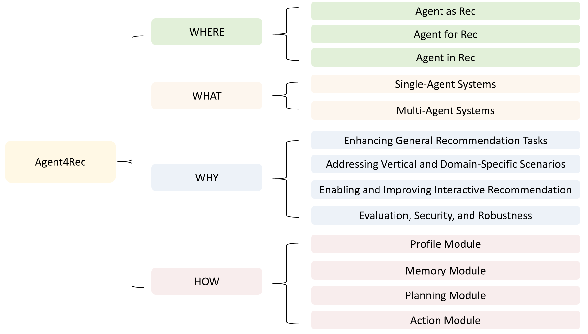
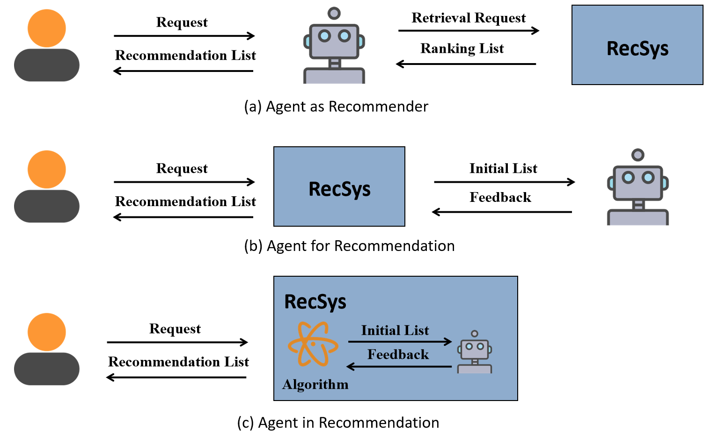
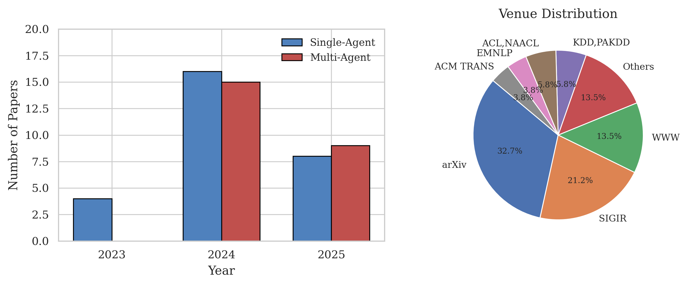

# Agent4Rec_Survey
A collection of resources and papers of **LLM-Based Agents for Recommender Systems** (Agent4Rec).
## Introduction
In our survey,  we offers a comprehensive review of recent research on LLM-based agents in recommendation systems from the past three years, examining four key dimensions: where agents are applied, what agents are used, why agents are used, and how agents are designed.For the **"WHERE"** question, we explore integration strategies for LLM-based agents and recommendation systems, categorized as Agent as Rec (primary entity), Agent for Rec (interacting to enhance performance), and Agent in Rec (embedded in specific process stages). For the **"WHAT"** question, we categorize the systems according to the quantity of agents they include, distinguishing between single-agent and multi-agent setups. For the **"WHY"** question, we categorize systems according to the specific issues they tackle within improving general recommendations, domain-specific recommendations, interactive recommendations, and system evaluation. For the **"HOW"** question, we highlights optimization approaches targeting the agents' core components—Profile, Memory, Planning, and Action Modules—to boost overall system performance.

We classify papers according to where LLM Agents will be adapted in the pipeline of RS, which is summarized in the figure below.

### The comparison between this work and existing surveys.
| **Paper** | **Where** | **What** |**Why** | **How** |**Pipeline** |**Highlights** |
| :------------- | :----------------------------------------------------------- | :----------------- | :------- |:------- |:------- |:------- |
| Recommender Systems Meet Large Language Model Agents: A Survey |  |✅|  |✅| (1) Agents for RS (2) RS for Agents (3) Trustworthy Agents and RS | analyzes how the LLM agent module supports recommendation systems and how recommendation systems,in turn, optimize the operation of these agents. |
| A Survey on LLM-powered Agents for Recommender Systems |  |✅|  |✅| (1) Recommender-oriented approaches (2) Interaction-oriented approaches (3) Simulation-oriented approaches | identifies three key paradigms in current research and explores their architectural components and evaluation frameworks.|
| A Survey of Large Language Model Empowered Agents for Recommendation and Search: Towards Next-Generation Information Retrieval |  |✅|  |✅| (1) User Interaction (2) Item Representation (3) System Integration (4) Environment Simulation | emphasizes how LLM-based agents improve recommender systems by enabling deep semantic understanding, dynamic task decomposition, and interactive user engagement |
| **Ours** |✅|✅|✅|✅| (1) Where agents are applied (2) What agents are used (3) Why agents are used (4) How agents are designed | proposes four key questions—"Where," "What," "Why," and "How" to conduct a comprehensive analysis of the existing academic research. |
## Key Contributions
1. A comprehensive review of the application of agents in RS across four dimensions from 2023 to 2025.
2. A novel system taxonomy is proposed, categorizing the integration strategies of LLM-based agents in recommendation systems into three paradigms.
3. Challenges for recommendation agents include computational cost, confidence, data security, robustness, and scalability among multiple agents.

## Paper List
### Agent as Rec
| **Model Name** | **Paper**     | **Single/Multi** | **Application Scenarios** |**Venue** |
| :------------- | :----------- | :--------|:--------| :-------- |
| PUMA | [Large Language Models Empowered Personalized Web Agents](https://arxiv.org/pdf/2410.17236) | Single | Domain-Specific | WWW'25  |
| TAIRA | [Thought-Augmented Planning for LLM-Powered Interactive Recommender Agent](https://arxiv.org/abs/2506.23485) | Multi | Interactive Improvement | arXiv'25|
| MMAgentRec | [MMAgentRec, a personalized multi-modal recommendation agent with large language model](https://www.nature.com/articles/s41598-025-96458-w) | Multi | Domain-Specific | Scientific Reports'25|
| MATCHA | [MATCHA:CanMulti-Agent Collaboration Build a Trustworthy  Conversational Recommender?](https://arxiv.org/pdf/2504.20094) | Multi | Interactive Improvement | arXiv'25 |
| MAS4POI | [MAS4POI: a Multi-Agents Collaboration System  for Next POI Recommendation](https://arxiv.org/pdf/2409.13700) | Multi | Domain-Specific |PAKDD'24 |
| RecMind | [RecMind: Large Language Model Powered Agent For Recommendation](https://arxiv.org/pdf/2308.14296) |Single | General Recommendation | NAACL'24   |
| InteRecAgent| [Recommender AI Agent: Integrating Large Language Models for Interactive Recommendations](https://arxiv.org/pdf/2308.16505) |Single | Interactive Improvement | ACM TRANS'24  |
| Shuang et al. | [An Extremely Data-efficient and Generative LLM-based Reinforcement Learning Agent for Recommenders](https://arxiv.org/pdf/2408.16032) | Single | Domain-Specific | KDD'24  |
| RecAI | [RecAI: Leveraging Large Language Models for Next-Generation Recommender Systems](https://arxiv.org/pdf/2403.06465) |Single | General Recommendation | WWW'24 |
| MACRec | [MACRec: a Multi-Agent Collaboration Framework for Recommendation](https://arxiv.org/pdf/2402.15235) | Multi | General Recommendation |SIGIR'24 |
| ChatCRS | [Incorporating External Knowledge and Goal Guidance for LLM-based Conversational Recommender Systems](https://arxiv.org/pdf/2405.01868) | Multi | Interactive Improvement | arXiv'24 |
| MACRS | [A Multi-Agent Conversational Recommender System](https://arxiv.org/pdf/2402.01135) | Multi | Interactive Improvement | arXiv'24  |
| PMS | [Personalized Recommendation Systems using Multimodal, Autonomous, Multi Agent Systems](https://arxiv.org/pdf/2410.19855) | Multi | Interactive Improvement | arXiv'24  |
| Yang Zhao et al. | [Multi-scenario combination based on multi-agent reinforcement learning to optimize the advertising recommendation system](https://www.arxiv.org/pdf/2407.02759v1) | Multi | Domain-Specific | IEEE'24 |
| Rec4Agentverse | [Prospect Personalized Recommendation on Large Language Model-based Agent Platform](https://arxiv.org/pdf/2402.18240) | Multi | Interactive Improvement | arXiv'24  |

### Agent for Rec

| **Model Name**  | **Paper** | **Single/Multi** | **Application Scenarios** | **Venue** |
| :--------------- | :-------|:--------|:--------| :--------|
| DrunkAgent | [Get the Agents Drunk: Memory Perturbations in Autonomous  Agent-based Recommender Systems](https://arxiv.org/pdf/2503.23804) |Single | Evaluation & Security | arXiv'25 |
| iAgent | [iAgent: LLM Agent as a Shield between User and Recommender Systems](https://arxiv.org/pdf/2502.14662) | Single | Interactive Improvement | ACL'25|
| iALP | [Large Language Model driven Policy Exploration for  Recommender Systems](https://arxiv.org/pdf/2501.13816) |Single | Interactive Improvement | WSDM'25 |
| RuleAgent | [RuleAgent: Discovering Rules for Recommendation Denoising  with Autonomous Language Agents](https://arxiv.org/pdf/2503.23374) |Single | Domain-Specific | arXiv'25  |
| ARAG | [ARAG: Agentic Retrieval Augmented Generation for  Personalized Recommendation](https://arxiv.org/pdf/2506.21931) |Multi | General Recommendation |SIGIR'25 |
| RecUserSim | [RecUserSim: A Realistic and Diverse User Simulator for  Evaluating Conversational Recommender Systems](https://dl.acm.org/doi/pdf/10.1145/3701716.3715258) |Single | Evaluation & Security | WWW'25 |
| DiscomfortFilter | [Filtering discomforting recommendations with large language models](https://arxiv.org/pdf/2410.05411) |Multi | Domain-Specific | WWW'25 |
| RecAgent | [User Behavior Simulation with Large Language Model based Agents](https://arxiv.org/pdf/2306.02552) | Single | Evaluation & Security | ACM TRANS'25 |
| Chirag Shah et al. | [Dynamic Evaluation Framework for Personalized and Trustworthy Agents: A Multi-Session Approach to Preference Adaptability](https://www.arxiv.org/pdf/2504.06277) | Multi | Evaluation & Security | arXiv'25 |
| TextSimu | [ID-Free Not Risk-Free: LLM-Powered Agents Unveil Risks in  ID-Free Recommender Systems](https://arxiv.org/pdf/2409.11690v3) | Multi | Evaluation & Security | SIGIR'25  |
| CreAgent | [CreAgent: Towards Long-Term Evaluation of Recommender System under Platform-Creator Information Asymmetry](https://arxiv.org/pdf/2502.07307) |Single | Evaluation & Security | arXiv'25  |
| CSHI | [A LLM-based Controllable, Scalable, Human-Involved User Simulator Framework for Conversational Recommender Systems](https://arxiv.org/pdf/2405.08035) |Single | Interactive Improvement | WWW'24 |
| Lusifer | [Lusifer: LLM-based User Simulated Feedback  Environment For online Recommender systems](https://www.arxiv.org/pdf/2405.13362v4) |Single | Domain-Specific | arXiv'24 |
| SUBER | [SUBER: AnRLEnvironment with Simulated  HumanBehavior for Recommender Systems](https://arxiv.org/pdf/2406.01631) |Single | Evaluation & Security | arXiv'24 |
| SimpleUserSim | [How Reliable is Your Simulator? Analysis on the Limitations of  Current LLM-based User Simulators for Conversational  Recommendation](https://arxiv.org/pdf/2403.16416) |Single | Evaluation & Security | WWW'24 |
| RAH  | [RAH! RecSys-Assistant-Human: A Human-Centered Recommendation Framework with LLM Agents](https://arxiv.org/pdf/2308.09904) |Multi | General Recommendation |TCSS'24 |
| Agent4Rec | [On Generative Agents in Recommendation](https://arxiv.org/pdf/2310.10108) |Multi| Evaluation & Security | SIGIR'24  |
| PEPPER | [Stop Playing the Guessing Game ! Target-free User Simulation for Evaluating Conversational Recommender Systems](https://www.arxiv.org/pdf/2411.16160) |Single| Evaluation & Security | arXiv'24  |
| PEARL | [PEARL: Preference Extraction with Exemplar Augmentation and Retrieval with LLM Agents](https://aclanthology.org/2024.emnlp-industry.112.pdf) | Multi | Domain-Specific | EMNLP'24 |
| Yoon et al.| [Evaluating Large Language Models as Generative User Simulators for  Conversational Recommendation](https://arxiv.org/pdf/2403.09738) |Single |Evaluation & Security | ACL'24  |
| CheatAgent  | [CheatAgent: Attacking LLM-Empowered Recommender Systems via LLM Agent](https://dl.acm.org/doi/10.1145/3637528.3671837) |Single | Evaluation & Security | KDD'24 |
| Zhang et al. | [LLM-Powered User Simulator for Recommender System](https://arxiv.org/pdf/2412.16984) |Single |  General Recommendation |AAAI'24 |
| ToolRec   | [Let Me Do It For You: Towards LLM Empowered Recommendation via Tool Learning](https://arxiv.org/pdf/2405.15114) |Single | Domain-Specific |SIGIR'24 |
| USimAgent | [USimAgent: Large Language Models for Simulating Search Users](https://arxiv.org/pdf/2403.09142) |Single | Evaluation & Security | SIGIR'24 |
| CORE | [Lending Interaction Wings to Recommender Systems with Conversational Agents](https://arxiv.org/pdf/2310.04230) |Single | Interactive Improvement | NeurlPS'23  |
| iEvaLM | [Rethinking the Evaluation for Conversational Recommendation  in the Era of Large Language Models](https://arxiv.org/pdf/2305.13112) | Single | Evaluation & Security | EMNLP'23 |
| Chat-REC| [Chat-REC: Towards Interactive and Explainable  LLMs-Augmented Recommender System](https://www.arxiv.org/pdf/2303.14524) | Single | Interactive Improvement | arXiv'23|

### Agent in Rec
| **Model Name** | **Paper**   | **Single/Multi** | **Application Scenarios** | **Venue**|
| :------------- | :---------- | :--------|:--------|:------|
| AgentCF++ | [AgentCF++: Memory-enhanced LLM-based Agents for  Popularity-aware Cross-domain Recommendations](https://arxiv.org/pdf/2502.13843) | Multi | General Recommendation | SIGIR'25 |
| CARTS | [CARTS: Collaborative agents for recommendation textual summarization](http://arxiv.org/pdf/2506.17765) | Multi | Domain-Specific |arXiv'25 |
| VRAgent-R1 | [VRAgent-R1: Boosting Video Recommendation with MLLM-based Agents via Reinforcement Learning](https://arxiv.org/abs/2507.02626) |Multi | Domain-Specific | arXiv'25 |
| KGLA | [KGLA: Knowledge Graph Enhanced Language Agents for Recommendation](https://arxiv.org/pdf/2410.19627) | Multi | General Recommendation |arXiv'24  |
| AFL  | [Agentic Feedback Loop Modeling Improves Recommendation  and User Simulation](https://arxiv.org/pdf/2410.20027v2) | Multi | Domain-Specific | SIGIR'24 |
| Jie Wang et al.| [Reinforcement Learning-based Recommender Systems with  Large Language Models for State Reward and Action Modeling](https://www.arxiv.org/pdf/2403.16948) | Single | General Recommendation |SIGIR'24|
| BiLLP | [Large Language Models are Learnable Planners for Long-Term  Recommendation](https://arxiv.org/pdf/2403.00843) | Multi | Evaluation & Security | SIGIR'24 |
| AgentCF | [AgentCF: Collaborative Learning with Autonomous Language  Agents for Recommender Systems](https://arxiv.org/pdf/2310.09233) |Multi | Interactive Improvement | WWW'24 |
| CSA | [Contrastive State Augmentations for Reinforcement  Learning-Based Recommender Systems](https://www.arxiv.org/pdf/2305.11081) | Single | General Recommendation |SIGIR'23 |
| AutoConcierge | [Automated Interactive Domain-Specific Conversational Agents that Understand Human Dialogs](https://arxiv.org/pdf/2303.08941) |Single | Domain-Specific | PADL'23 |

